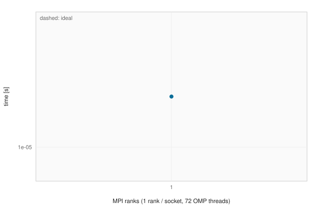
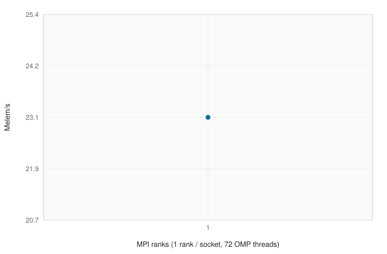

# PERFORMANCE.md

Hybrid strong scaling on CSCS Alps (GH200): **1 MPI rank per socket**, 72 OpenMP threads.
Points: 1 socket (1×72), 1 node (4×72), 2 / 4 / 8 / 16 nodes (8 / 16 / 32 / 64 ranks).

## Method

- Driver: `smesh_bench` (`src/benchmark/drivers/smesh_bench.exe.cpp`). Wall time is `max` over ranks after `MPI_Barrier`.
- Each kernel is repeated `SMESH_BENCH_REPEAT` times (default 3). Tables use the **median**.
- Default sizes: HEX8 `N=512` (`N³` hexes); TET4 `SMESH_BENCH_TET_N=256` (`6 N³` tets). Override with `SMESH_BENCH_N`.
- Throughput: `n_elements / time` (Melem/s). IO also reports GiB/s from `n_nodes * sdim * sizeof(geom_t) + n_elements * nxe * sizeof(idx_t)`.
- Efficiency: `T_1 / ((P / P_1) * T_P)` relative to the smallest rank count in the CSV (the 1-socket point when present).
- Alps build: `-DSMESH_ENABLE_MPI=ON -DSMESH_ENABLE_OPENMP=ON -DCMAKE_BUILD_TYPE=Release`.
- Submit: `scripts/slurm/alps/submit_strong_scaling.sh`. CSV files land in `docs/bench/`. Regenerate this page with `scripts/bench/plot_performance.py`.
- `docs/bench/results.smoke.csv` is a local `N=8` generate check, not an Alps result. Sections with `nodes = —` were not run under Slurm.

`create_cube` uses serial fill when `comm_size == 1` and distributed create when `comm_size > 1`. The 1-socket generate point is a different kernel than 4+ ranks. Refine and promote use the production MPI paths.

OpenMP helps SS refine graphs. Distributed generate is MPI-decomposed and is not itself an OpenMP loop.

## generate HEX8 N=8 (local / non-Slurm rows present)

| ranks | nodes | N | elems | time [s] | Melem/s | GiB/s | efficiency |
|------:|------:|--:|------:|---------:|--------:|------:|-----------:|
| 1 | — | 8 | 512 | 2.221e-05 | 23.05 | 1.054 | 1.000 |

